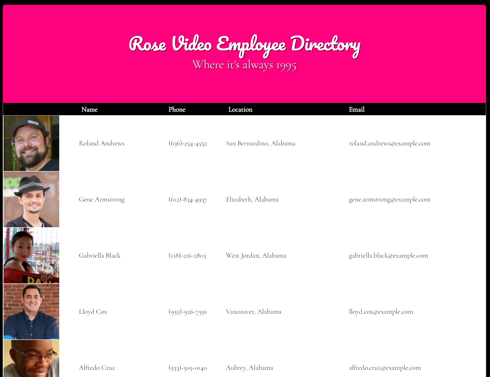

# Rose Video Employee Directory

[Demo](https://bradpritchett.github.io/BP-employee-directory/)

This React app simulates the Employee Directory of a non-existant video rental store. It queries the [Random User Generator](https://randomuser.me/) and returns the data in a sortable table.

## Installation

npm i 

## Dependencies

This project utilizes React, React-Bootstrap, AXIOS and gh-pages for deployment.
